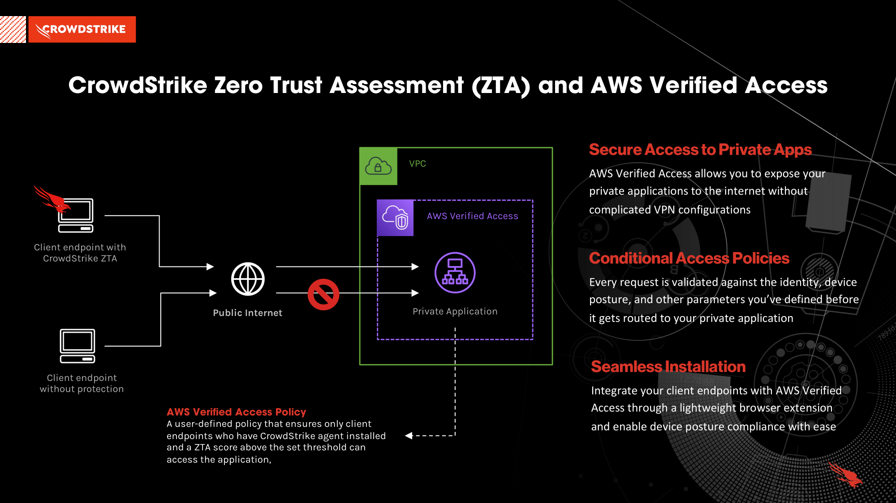
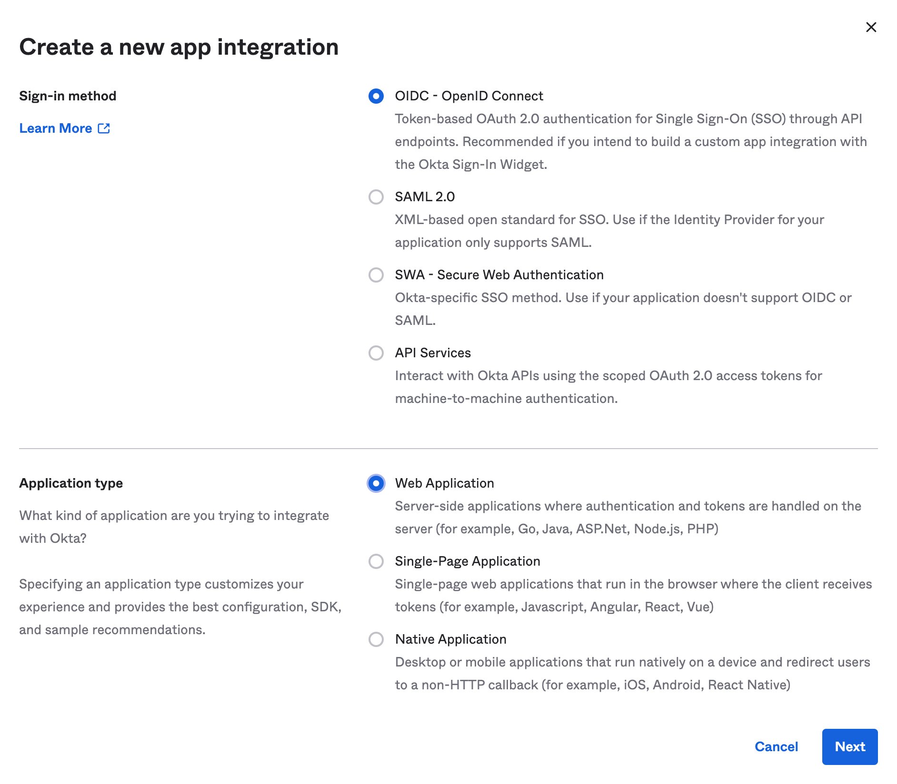

<br>


# Securing private applications with CrowdStrike and AWS Verified Access

AWS Verified Access delivers secure access to private applications without a VPN by continuously evaluating each request in real-time based on contextual security signals like identity, device security status and location. The service then grants access based on the configured security policy for each application and connects the users, thereby improving security posture of the organization. CrowdStrike customers leverage Falcon sensor's deep inspection and CrowdStrike Threat Graph® analytics to provide highly accurate security posture scores for the service's access decisions.

## Table of Contents

- [Overview](#overview)
  - [What is AWS Verified Access](#what-is-aws-verified-access)
  - [Integration overview](#integration-overview)
  - [Prerequisites](#prerequisites)
  - [AWS Verified Access components](#aws-verified-access-components)
- [Quick-start guide](#quick-start-guide)
  - [1. Deploy the private application](#1-deploy-the-private-application)
  - [2. Setting up your OIDC-compliant identity provider](#2-setting-up-your-oidc-compliant-identity-provider)
  - [3. Create your AWS Verified Access Instance](#3-create-your-aws-verified-access-instance)
  - [4. Create AWS Verified Access Trust Providers](#4-create-aws-verified-access-trust-providers)
    - [4.1. Create your Okta trust provider](#41-create-your-okta-trust-provider)
    - [4.2. Create the CrowdStrike trust provider](#42-create-the-crowdstrike-trust-provider)
  - [5. Attach your trust providers](#5-attach-your-trust-providers)
    - [5.1. Attach your Okta trust provider](#51-attach-your-okta-trust-provider)
    - [5.2. Attach your CrowdStrike trust provider](#52-attach-your-crowdstrike-trust-provider)
  - [6. Create your AWS Verified Access Group](#6-create-your-aws-verified-access-group)
  - [7. Create a certificate](#7-create-a-certificate)
  - [8. Create your AWS Verified Access Endpoint](#8-create-your-aws-verified-access-endpoint)
  - [9. Update your DNS records](#9-update-your-dns-records)
  - [10. Update your Identity Provider settings](#10-update-your-identity-provider-settings)
  - [11. Install the Native Message Host](#11-install-the-native-message-host)
    - [Windows](#windows)
  - [12. Install the browser extension](#12-install-the-browser-extension)
  - [13. Verification](#13-verification)
- [Support](#support)

## Overview

AWS Verified Access provides secure access to private applications (non-internet routable) hosted in an Amazon Virtual Private Cloud (Amazon VPC) by acting as a reverse proxy. It does this by providing identity and device posture checks before routing the traffic to the application. Using CrowdStrike Zero Trust Assessment (CrowdStrike ZTA), we provide customers the ability to assess their endpoint security posture, allowing AWS Verified Access to provide conditional access to resources that comply to your organization's device posture policies.

AWS Verified Access relies on these primary components for it to work properly:

1. Setting up the AWS Verified Access components i.e., (AWS Verified Access instances, access groups, access policies, endpoints, and trust providers).
1. Browser extensions that are installed on client endpoints for device posture evaluation.
1. An installer that sets up a [Native Message](https://developer.chrome.com/docs/apps/nativeMessaging/) Host. The host is responsible for reading the CrowdStrike ZTA score and securely communicating the payload to the browser extension.

### AWS Verified Access components

- **Verified Access Instance:** An AWS resource that allows customers to group together configured Verified Access Trust Providers and Verified Access Groups.

- **Verified Access Groups:** A collection of endpoints defining your applications that have similar security requirements. Each endpoint within a group shares a Verified Access Policy.

- **Verified Access Endpoint:** Where your application details are defined i.e., (networking, load balancer, domain, etc.)

- **Verified Access Policy:** User defined rules that allow or deny access to applications using a combination of factors, including user identity, device security state, and additional context (geolocation, risk profile, etc.).

- **Verified Access Trust Provider:** An OIDC-compliant identity provider i.e., (AWS IAM, Okta, CyberArk, etc.)



## Getting Started
### Prerequisites

The following requirements must be met before you will be able to deploy or use this solution:

1. Have a current CrowdStrike Insights XDR subscription
1. Raise a ticket with [CrowdStrike support](https://supportportal.crowdstrike.com/) to have the ZTA file deployed to your environment by enabling the following feature flag: `zta_distribute_payload`
1. You must have an OIDC-compliant Identity Provider (IdP) configured to setup AWS Verified Access
### Quick-start guide

The following guide provides step-by-step instructions that showcase a sample application that's protected by AWS Verified Access, Okta (for OIDC), and CrowdStrike Zero Trust Assessment (for Device Posture). The solution will be deployed in `us-west-2`. If you'd like to deploy this elsewhere, please update the region in all commands referenced below.

### 1. Deploy the private application

We'll be deploying an internal Application Load Balancer (ALB) through CloudFormation. The only functionality of this is ALB is to emulate a private application by mocking a response on a successful hit.

1. Deploy the [CloudFormation template](infrastructure/cfn-alb.json) in your AWS account
1. Once deployment is complete, refer to the CloudFormation Stack Output and collect the following information that will be used when creating the AWS Verified Access Endpoint in a later section: `ALBArn`, `SecurityGroup`, `Subnet1`, `Subnet2`, and `Subnet3`.

### 2. Setting up your OIDC-compliant identity provider

In this guide, we'll be using a free trial version of Okta for our OIDC provider. If you prefer to follow along with another provider, the steps are nearly identical.

1. [Sign up for a free trial to Okta](https://www.okta.com/free-trial/)
1. Create a new application with an OIDC as the sign-in method
   
1. Set the following parameters and click save:
   - **App integration name:** Any name
   - **Grant Type:** Authorization Code
   - **Controlled access**: Allow everyone in your organization to access
1. Save your `Client ID` and `Client Secret`
1. Save your Okta Tenant URL.
   1. Example: If your Okta Admin URL is <https://trial-11111-admin.okta.com>, then your Okta Tenant URL is <https://trial-11111.okta.com>

### 3. Create your AWS Verified Access Instance

1. Create your AWS Verified Access Instance

   ```shell
   aws ec2 create-verified-access-instance \
   --region us-west-2 \
   --description "CrowdStrike + AWS Verified Access Demo"
   ```

1. Save the value of `VerifiedAccessInstanceId`

### 4. Create AWS Verified Access Trust Providers

In this step you'll create two trust providers, one for your IdP and another for CrowdStrike.

#### 4.1. Create your Okta trust provider

1. Replace the following values in the command below before running:
   1. `{{ Okta Tenant URL }}`, `{{ Okta Client ID }}`, `{{ Okta Client Secret }}`

   ```shell
   aws ec2 create-verified-access-trust-provider \
   --trust-provider-type user \
   --policy-reference-name "okta" \
   --user-trust-provider-type oidc \
   --oidc-options \
   "Issuer={{ Okta Tenant URL }}, \
   AuthorizationEndpoint={{ Okta Tenant URL }}/oauth2/v1/authorize, \
   TokenEndpoint={{ Okta Tenant URL }}/oauth2/v1/token, \
   UserInfoEndpoint={{ Okta Tenant URL }}/oauth2/v1/userinfo, \
   ClientId={{ Okta Client ID }}, \
   ClientSecret={{ Okta Client Secret}}, \
   Scope='openid groups profile email'" \
   --region us-west-2 \
   --description "Okta OIDC trust provider"
   ```

1. Save the value of `VerifiedAccessTrustProviderId`

#### 4.2. Create the CrowdStrike trust provider

1. Replace the following values in the command below before running:
   1. `{{ TenantId }}` with your CrowdStrike Customer ID (CID)

   ```shell
   aws ec2 create-verified-access-trust-provider \
   --trust-provider-type device \
   --policy-reference-name "crowdstrike" \
   --device-trust-provider-type crowdstrike \
   --device-options \
   "TenantId={{ TenantID }}" \
   --region us-west-2 \
   --description "CrowdStrike trust provider"
   ```

1. Save the value of `VerifiedAccessTrustProviderId`

### 5. Attach your trust providers

In this step, you'll be attaching the two Trust Providers you created in the previous step to the AWS Verified Access Instance created earlier.

#### 5.1. Attach your Okta trust provider

1. Replace the following values in the command below before running:
   1. `{{ Verified Instance ID` }} and `{{ Okta Trust Provider ID }}`

      ```shell
      aws ec2 attach-verified-access-trust-provider \
      --verified-access-instance-id "{{ Verified Instance ID}}" \
      --verified-access-trust-provider-id "{{ Okta Trust Provider ID}}" \
      --region us-west-2
      ```

#### 5.2. Attach your CrowdStrike trust provider

1. Replace the following values in the command below before running:
   1. `{{ Verified Instance ID }}` and `{{ CrowdStrike Trust Provider ID }}`

      ```shell
      aws ec2 attach-verified-access-trust-provider \
      --verified-access-instance-id "{{ Verified Instance ID}}" \
      --verified-access-trust-provider-id "{{ CrowdStrike Trust Provider ID}}" \
      --region us-west-2
      ```

### 6. Create your AWS Verified Access Group

In this step, you'll create your AWS Verified Access Group. Inside, you'll define a policy that will determine access based on the OIDC IdP, device posture, and other parameters provided by the AWS Verified Access service. For this guide, we'll create a policy document that checks that the client has the CrowdStrike agent installed, belongs to our CID, and has an overall ZTA score higher than 80.

> Clients will need to successfully log into your Identity Provider before the policy document is evaluated. As such, any identity provider conditions you set in your policy document are evaluated on top of the successful login.

1. Replace the following values in the command below before running:
   1. `{{ Verified Instance ID }}` and `{{ CrowdStrike CID }}`

   ```shell
   aws ec2 create-verified-access-group \
   --verified-access-instance-id {{ Verified Instance ID }} \
   --policy-document \
   "permit(principal,action,resource) when {\
      context.crowdstrike.cid == \"{{ CrowdStrike CID }}\" && context.crowdstrike.assessment.overall > 80\
   };" \
   --region us-west-2 \
   --description "CrowdStrike + AWS Verified Access Demo | Threshold Example"
   ```

1. Save the value of `VerifiedAccessGroupId`

### 7. Create a certificate

In this step, you'll use AWS Certificate Manager to create a certificate for the domain of your private application.

1. Navigate to the [AWS Certificate Manager](https://console.aws.amazon.com/acm) console page
1. Click `Request a certificate`
1. Select `Request a public certificate` and press `Next`
1. Type in the domain name of your application and press `Request`
   1. *This should belong to a domain which you manage, as you'll need to create DNS records in future steps*
1. Verify the certificate by creating the necessary CNAME records as instructed
1. Save the `ARN` of the certificate

### 8. Create your AWS Verified Access Endpoint

In this step, you'll bring everything together and create the AWS Verified Access Endpoint that will act as the reverse proxy for your private application.

> Please note that it takes 10-30 minutes for the endpoint to provision. If you make any changes to the endpoint, it will typically take 5-15 minutes for it to take into effect.

1. Replace the following values in the command below before running:
   1.`{{ Verified Access Group }}`, `{{ Certificate ARN }}`, `{{ Private Application Domain Name }}`, `{{ ALB ARN }}`, `{{ Subnet1 }}`, `{{ Subnet2 }}` and `{{ SecurityGroup }}`

   ```shell
   aws ec2 create-verified-access-endpoint \
   --verified-access-group-id {{ Verified Access Group }} \
   --endpoint-type load-balancer \
   --attachment-type vpc \
   --domain-certificate-arn {{ Certificate ARN }} \
   --application-domain {{ Private Application Domain Name }} \
   --endpoint-domain-prefix demo \
   --load-balancer-options \
   "LoadBalancerArn={{ ALB ARN }}, \
   Port=80, \
   Protocol=http, \
   SubnetIds={{ Subnet1 }}, {{ Subnet2 }} " \
   --security-group-ids {{ SecurityGroup }} \
   --region us-west-2 \
   --description "CrowdStrike + AWS Verified Access Demo"
   ```

1. Save the value of `VerifiedAccessEndpointId`, `EndpointDomain`, `ApplicationDomain`, and `DeviceValidationDomain`

1. Before moving on, ensure that the endpoint has been succesfully provisioned

   ```shell
   aws ec2 describe-verified-access-endpoints --verified-access-endpoint-ids {{ VerifiedAccessEndpointId }} --region us-west-2
   ```
   You should see:

   ```json
      ...
      "Status": {
            "Code": "active"
      },
      ...
   ```

### 9. Update your DNS records

In this step, you'll update your DNS records to point your private application's domain name to the endpoint domain created by the AWS Verified Access Endpoint you created in the previous step. For this example, we'll assume that you're using Amazon Route53 to manage your domain's DNS. If you're using another DNS provider, please adjust the steps accordingly.

1. Navigate to Amazon Route53 console page -> Hosted Zones
1. Select the domain name for your private application
1. Press `Create record`
1. Type the subdomain you created earlier and select `CNAME` as the Record type. Set the value of the record to be the value of `EndpointDomain` you saved in the previous step and press `Create records`

### 10. Update your Identity Provider settings

In this step, you'll update your Okta's application settings. Specifically, we'll be adding the AWS Verified Access URLs to the Sign-in redirect URIs. This will tell Okta to send the authentication response to these URLs.

1. Navigate to your Okta Administrator page and select the application you created
1. Press `Edit` under General Settings
1. Add the following URLs under ***Sign-in redirect URIs***:
   > Replace the placeholders `{{ ApplicationDomain }}` and `{{ DeviceValidationDomain }}` with the relevant values
   1. https://{{ ApplicationDomain }}/oauth2/idpresponse
   1. https://{{ DeviceValidationDomain }}/oauth2/idpresponse

### 11. Install the Native Message Host

In this step, you'll install the Native Message Host on your client endpoint. This will allow the AWS Verified Access browser extension to get the client endpoint's CrowdStrike ZTA score.

> :warning: **Currently only works on Windows** <br>
>
> AWS Verified Access is currently available for Windows clients while the service is in public preview. Support for macOS will be introduced at service launch.

#### Windows

1. Download the MSI via the [following link](https://d3p8dc6667u8pq.cloudfront.net/WPF/latest/AWS_Verified_Access_Native_Messaging_Host.msi)
1. Install the MSI on your Windows client endpoint

### 12. Install the browser extension

In this step, you'll install the AWS Verified Access browser extension on your client endpoint. In this example, we'll be using the Chrome browser. However, AWS Verified Access supports Firefox, too and the instructions are nearly identical.

1. Navigate to the [Chrome Extension Store](https://chrome.google.com/webstore/category/extensions)
1. Search for `AWS Verified Access` and install the extension

### 13. Verification

In this step, you'll verify that your private application is properly protected by AWS Verified Access.

1. Confirm that the AWS Verified Access Endpoint is successfully provisioned by running `aws ava  describe-verified-access-endpoints` and confirm that `Status.Code` is equal to `Active`
1. Navigate to your private application domain, which is the value of `ApplicationDomain`
1. Log into your identity provider
1. If you're navigating on a client machine that meets the criteria to access the private application, you'll see `Mock response`
1. If you're navigating on a client machine that doesn't meet the criteria, you'll see `Redirecting...`, which is the automated response from AWS Verified Access

## Support

The quick start guide is an open source project and not a CrowdStrike product. As such, it carries no formal support, expressed, or implied. If you encounter any issues while deploying the quick start guide, you can create an issue on our Github repository for bugs, enhancements, or other requests.

AWS Verified Access is an AWS product. As such, any questions or problems you experience with this service should be handled through a support ticket with AWS Support.
